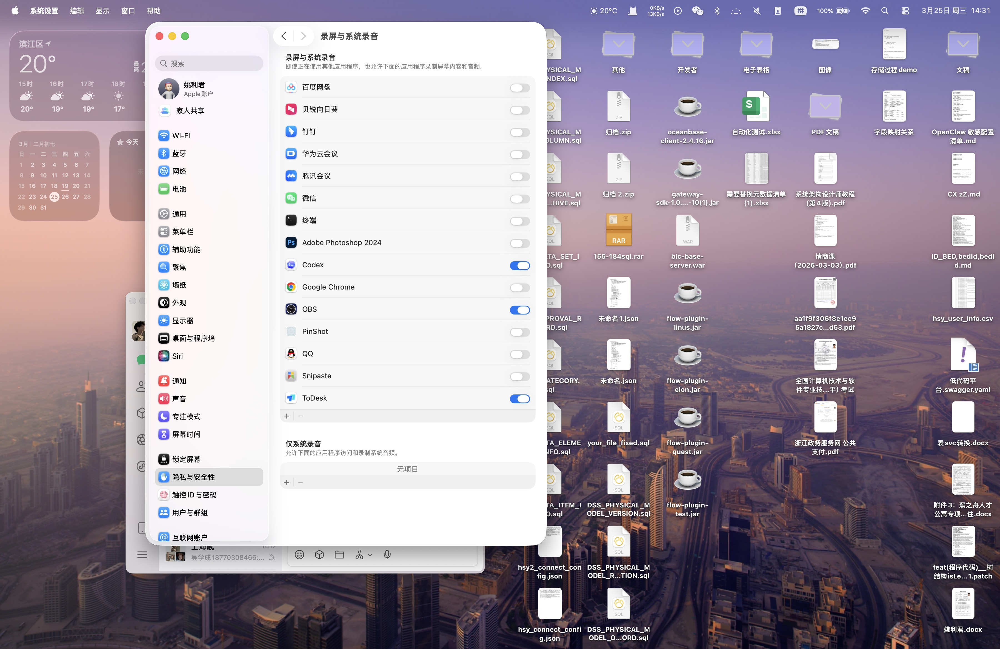

# PinShot 0.3.0 Test Report

- Date: 2026-03-25
- Workspace: `/Users/yaolijun/Documents/PinShot`
- Installed app: `/Applications/PinShot.app`
- Installed version: `0.3.0 (4)`

## Scope

This round focused on:

- internal refactoring without changing the current capture flow
- adding a launch-at-login toggle with a default enabled preference
- packaging, installing, and verifying the bundled app

## Automated Validation

### 1. Debug build

Command:

```bash
swift build
```

Result: passed

### 2. Release build

Command:

```bash
swift build -c release --product PinShot
```

Result: passed

### 3. Built-in self-check

Command:

```bash
/Applications/PinShot.app/Contents/MacOS/PinShot --self-check
```

Result: passed

Observed output:

```text
PASS - Launch-at-login defaults to enabled
PASS - Hotkey configuration round-trips through preferences
PASS - History formatter uses fallback title
PASS - Chooser origin clamps into visible frame
PASS - Capture placement resolves image width
PASS - Capture placement resolves image height
PASS - Capture placement stays inside screen bounds
PASS - Panel layout preserves natural width
PASS - Panel layout expands for toolbar and inspector
PASS - Launch-at-login support matches bundle environment
SELF-CHECK PASSED
```

### 4. Bundle signature

Command:

```bash
codesign --verify --deep --strict /Applications/PinShot.app
```

Result: passed

### 5. Launch-at-login registration

Validation command:

```bash
sfltool dumpbtm | rg "com\\.pinshot\\.PinShot|PinShot" -C 2
```

Observed excerpt:

```text
Name: PinShot
Disposition: [enabled, allowed, notified] (0xb)
Identifier: 2.com.pinshot.PinShot
URL: file:///Applications/PinShot.app/
Bundle Identifier: com.pinshot.PinShot
```

Result: passed

## Visual Verification

- Installed app launches successfully from `/Applications/PinShot.app`
- Background login item is visible in System Settings > General > Login Items

Screenshot:



## Notes

- The shell environment on this machine does not currently have Accessibility automation permission for `osascript` or Terminal, so fully scripted UI interaction for every capture/annotation gesture is not available from this session.
- The shipped capture interaction path remains the stable system-native area selection flow that was already verified in prior iterations, and this release keeps that behavior intact while adding launch-at-login support and internal cleanup.
